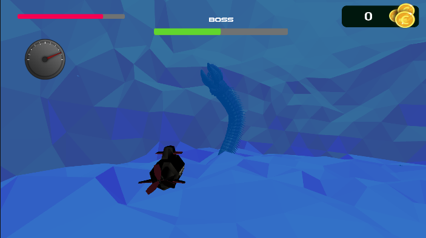

# Oceanest-SubCliquey
 Game Development Final Project

# **Student Information**

* 21125060 \- Nguyễn Minh Quang  
* 21125170 \- Hồ Ngọc Vĩnh Phát  
* 22125077 \- Nguyễn Hoàng Phúc  
* 22125108 \- Vòng Vĩnh Toàn

# Unity version: 2022.3.29f1

# Poster

# Oceanest is now live on [itch.io](https://htamlive.itch.io/oceanest)!

# Trailer is now on [YouTube](https://youtu.be/TdvYZlLc4hU)!

# **Introduction**

Oceanest: A Deep-Sea Odyssey

Genre: Action-Adventure, Exploration, and Monster Hunting

In *Oceanest*, players dive into an exciting action-adventure set in the mysterious and dangerous depths of the ocean. You play as a seasoned sailor, someone who has spent years at sea, driven by a deep love for exploring the unknown. One day, you stumble upon a strange map that hints at a hidden treasure beneath the waves, and without a second thought, you’re ready to dive into the adventure of a lifetime.

With your trusty submarine, you set off into the deep sea, eager to uncover secrets and treasures long forgotten. But it’s not just the treasure waiting for you—massive, terrifying sea creatures lurk in the darkness, ready to put your courage to the test. Armed with your submarine’s weapons and your quick thinking, you’ll need to fight these monsters and survive the challenges of the ocean to reach the treasure.

Combining exploration, survival, and thrilling monster battles, *Oceanest* offers an unforgettable adventure that will push you to the limits. Will you uncover the ocean’s hidden mysteries, or will the deep sea become your final resting place?

# Winning objective

Upon completing the ultimate quest of defeating the final sea monster, your journey in *Oceanest* takes an unexpected, heartfelt turn. After the epic battle, you return to the old sea turtle, your mysterious guide throughout the adventure. Grateful for your bravery, the turtle releases an ancient power, forming a glowing wormhole that promises to lead you back home. But before you can leave, there’s one final task: navigating through the mischievous reef that has challenged you throughout your quest.

With skill and determination, you pilot your submarine through the familiar twists and turns of the reef one last time. At the heart of this maze lies the energy ball, left behind by the sea turtle. As you take hold of it, you're suddenly teleported home, marking the end of your deep-sea adventure.

But something unexpected happens. The treasure you sought isn’t a chest of gold or riches—it’s the return home itself. For a seasoned sailor like you, the ultimate treasure is finding your way back after one last incredible journey. It’s a fitting end to a glorious series of adventures, a peaceful return to where it all began, proving that sometimes, the greatest treasure is the journey itself.

# Features

## 1\. GUI

### 1.1. Dynamic Menu

When players open *Oceanest*, they are greeted with an inspiring and immersive menu screen that perfectly captures the deep-sea theme of the game. The background is a stunning blue, evoking the mysterious depths of the ocean. Dark waters are contrasted by vibrant schools of fish, lively coral reefs, and swaying seaweed, all gently moving as if alive. At the top left corner, the *Oceanest* logo is proudly displayed, setting the tone for the epic underwater adventure ahead.

The menu consists of five options, presented as radio buttons in a top-to-bottom order: Continue, Load Game, New Game, Tutorial, and Quit. Each button is designed to smoothly guide the player to their desired action:

* **Continue**: This option allows players to instantly jump back into their last game session. If you’ve already begun your adventure and want to pick up exactly where you left off, this is the button for you. It’s a handy feature for players who have invested time into the game and wish to continue their progress. However, this button only appears if there is a saved game session to continue.  
* **Load Game**: For players who want to open a saved game file, this option is the go-to. The game cleverly embeds saved data into a steganographic image, making loading a saved game both unique and seamless.  
* **New Game**: Ready for a fresh start? The New Game button allows players to begin a brand new adventure.  
* **Tutorial**: For those new to *Oceanest* or anyone wanting a refresher on the controls, the Tutorial option leads to a special scene with no monsters. Here, players can freely explore and learn the basics of controlling the submarine through an interactive tutorial, offering a relaxed space to practice without any pressure.  
* **Setting**: A player can use this button to personalize the game’s configuration. Further details are discussed [below](#1.4.-menu-setting).   
* **Quit**: This button does exactly what you’d expect—it exits the game and takes the player back to their desktop or console home screen.

Each menu option is crafted to give players an easy, smooth experience as they prepare to dive into the ocean's depths or return to shore.

### 1.2. Parallaxing

We use a technique called parallaxing to create a more dynamic and engaging menu screen. Parallaxing involves using multiple 2D layers that are arranged in 3D space, similar to how billboards are set up. These layers are designed to give the illusion of depth and distance as the camera moves.

The layers are placed at different distances from the camera and move at different speeds. When the camera, which is set in orthogonal mode, shifts position, the layers move at varying rates. Layers that are closer to the camera move faster than those further away. This difference in movement speeds creates a sense of depth and makes the scene feel more three-dimensional.

### 1.3. Pause Screen

The pause screen in *Oceanest* is designed to let players take a break easily. When the game is paused, the screen is covered by a pitch-black overlay that darkens everything in the background, putting full focus on the menu options. This strong contrast makes it clear that the game is paused without fully stopping your progress.

The pause menu offers three key buttons, arranged from top to bottom: Continue, Restart, and Quit.

* **Continue**: This button allows players to instantly return to the game exactly where they left off. If you’ve paused to take a quick break, this is the option to use to dive right back into the action.  
* **Restart**: For players who want a fresh start from the current level or encounter, the Restart button lets you reset the gameplay. Whether you want to tackle a challenge differently or simply start over, this option takes you back to the beginning of your current session.  
* **Quit**: The Quit button brings players back to the main menu screen. It's perfect for when you’re ready to exit your current game session but still want to navigate the main menu or start something new.

This straightforward pause screen keeps everything clear and easy to use, allowing players to quickly take action and get back into their deep-sea adventure.

### 1.4. Winning Screen

The winning screen in *Oceanest* is designed to give players a moment of triumph after completing their challenge. The screen is covered with a black overlay, creating a calm and focused atmosphere. At the center, the words "YOU WIN" appear in bright golden letters, slowly fading in to emphasize the victory. Right below it, there’s a single button labeled "Return to Menu."

* **Return to Menu**: This button takes players back to the main menu screen, where they can start a new game, load a saved file, or exit the game. It's a simple way to close out the current game session after a well-earned win.

This straightforward winning screen keeps the focus on celebrating the player's success while providing a quick path back to the main menu.

### 1.5. Game over scene

The game shows a distinct Game over scene that activates when the player’s character runs out of HP, signaling the end of the current gameplay session. Upon reaching this point, the screen transitions to a dedicated game over sequence, visually informing the player of their defeat.

In this scene, two primary options are presented to the player, allowing them to choose how they wish to proceed. The first option provides the ability to immediately restart the game, offering a seamless return to gameplay for those who wish to retry without delay. The second option allows the player to return to the main menu, providing a way to step back from the game and explore other options, such as reviewing settings, choosing a different game mode, or exiting altogether.

The "Game Over" text is animated in a dynamic and engaging way, gradually appearing on the screen. This gradual reveal adds a sense of impact and emphasizes the finality of the moment, enhancing the emotional weight of the player's defeat. The combination of these elements creates an intuitive and polished experience that smoothly transitions players from gameplay to decision-making.

### 1.6. Menu Setting

The game features a comprehensive menu setting system that allows players to customize various aspects of the game’s configuration to suit their preferences. Players can access the settings menu through two main pathways: either by selecting the "Settings" button from the main menu prior to starting the game, or by navigating to the settings from the pause screen during gameplay. This flexibility ensures that players can make adjustments both before and during their gaming experience, without interrupting the flow of the game.

Within the settings menu, players are provided with options to adjust both the music volume and the sound effect volume independently. This allows for a personalized auditory experience, catering to different preferences, whether players want to immerse themselves in the game's music, focus more on the sound effects, or balance both elements. These settings are designed to enhance user control, ensuring that the game's audio experience aligns with individual player preferences for maximum enjoyment.

## 2\. Gameplay mechanics

### 2.1. Submarine control

In *Oceanest*, controlling your submarine and managing your actions is simple with a few easy-to-remember keys. Here's how you can navigate and interact with the game:

* **A and D**: Steer the submarine left (A) or right (D).  
* **Q and E**: Use Q to slow down or brake, and E to boost your speed.  
* **W and S**: Press W to rise toward the surface, and S to dive deeper into the ocean.  
* **J**: Fire a missile to attack sea creatures.  
* **I**: Open the shop to upgrade your submarine or buy new gear.  
* **Esc**: Pause the game whenever you need a break.  
* **P**: Capture a screenshot of your gameplay while also saving your progress into a steganographic saved image.

### 2.2. Submarine self-balancing when disoriented

To prevent the submarine from rotating around its forward vector while ensuring smooth movement, we ensure it consistently returns to a neutral angle (0 degrees). When the submarine pitches up or down using the ‘w’ or ‘s’ keys, it will automatically rotate back to the neutral position (0 degrees) along its right vector after the key is released. To do that, we calculate the angle distance by subtracting the target angle (0 degrees) from the current angle, then the submarine will rotate toward the angle distance. The larger the distance is, the faster the submarine rotates, so it can rotate smoothly. We use the forward vector and right vector of the submarine itself (not global vectors) to identify the rotation axis.

### 2.3. Missiles

Missiles are your primary and most powerful weapon for hunting down the sea monsters that lurk in the deep ocean. They are crucial for battling these formidable creatures and are the only weapon you have at your disposal.

To use the missiles, first, aim the front of your submarine toward the target you want to hit. When you're ready to fire, press the shoot button (J). This action launches a powerful missile directly at the sea monster. The missile will travel through the water and deal damage to the boss, gradually reducing its health until it reaches zero.

One important thing to note is that, because these sea creatures are unknown to mankind, you won’t know exactly how many missiles it will take to defeat each monster. Each creature has its own strength and might require a different number of hits. However, you don’t need to worry about running out of missiles. Your submarine is equipped with an almost infinite supply, so you can keep firing as needed until the monster is defeated.

The missile system is designed to be straightforward and effective. By aiming carefully and using your missiles wisely, you can bring down even the toughest sea monsters and continue your exploration of the mysterious deep sea.

### 2.4. Shop and Upgrades

The shop is where players can upgrade their submarine to improve their chances in battle. There are two main upgrades available, each offering a unique benefit to help you in your adventure.

1. **Tracking Missiles**  
   This upgrade costs 15 coins. Tracking missiles are designed to make it easier to hit your targets. Once equipped, these missiles will automatically follow the boss or any other target you’re aiming at, improving your aim and making it less likely for the missiles to miss. This can be especially useful during tough battles where precision is key.  
2. **Double Missiles**  
   This upgrade costs 15 coins. With double missiles, your submarine can fire two missiles at once instead of just one. This effectively doubles the number of missiles you can shoot, which can significantly increase your firepower and make it easier to take down enemies.

At the beginning of the game, players will only have enough coins to purchase one of these upgrades. To get more coins and access the second upgrade, players need to defeat the first boss. Defeating the boss not only earns you more coins but also makes the next boss slightly easier to handle, giving you a better chance to buy the remaining upgrade.

With these upgrades, you can enhance your submarine's combat abilities, making it more effective in battle and better prepared for the challenges that lie ahead in the deep sea.

### 2.5. Boss

For the boss encounter in the game, a free asset has been utilized to represent the Giant Worm Boss, a choice made for both time-saving and convenience. By incorporating this premade asset, development time is reduced, allowing for a quicker integration of the boss into the game while maintaining the necessary level of detail and visual quality.

Upon entering the boss room, the Giant Worm Boss emerges, initiating an intense battle sequence as it launches an attack on the player's submarine. The design of the boss encounter revolves around two distinct attack strategies, each adding variety and challenge to the gameplay.

<!-- **![][image12]** -->

The first strategy is based on randomness. In this mode, the boss appears at unpredictable locations within the room and attacks in a random direction. This approach keeps the player on edge, requiring them to stay alert and react quickly, as the boss’s movements and attacks are difficult to anticipate.

The second strategy is a frontal attack, where the boss employs a more calculated approach. Here, the Giant Worm Boss predicts the submarine's future position and emerges directly in front of it, launching a precise and forceful strike. This creates a dynamic and challenging confrontation, as players must skillfully maneuver to avoid being caught by the boss’s well-timed attacks.

### 2.6. Old Sea Turtle NPC

In the game, the Old Sea Turtle NPC plays a key role in the player’s early interactions, situated in the first room, just behind a reef, as part of the underwater environment. This NPC serves not only as a character of interest but also as a guide to the player during their initial gameplay experience. The Old Sea Turtle is programmed with three distinct dialogue scripts, each designed for different interactions. 

The first script is used to greet the player, establishing a welcoming tone. The second offers advice, providing guidance or important information necessary for progressing through the game. The final script is a “thank you,” likely triggered after defeating the boss, creating a sense of closure and rewarding the player’s engagement with the NPC.

To enhance the interaction experience, a visual marker is used to draw attention to the NPC when the player approaches. This marker is animated to pop up as the player comes within a certain proximity to the Old Sea Turtle, making it clear that an interaction is available. The marker stands out from the underwater setting by utilizing a special rendering technique: a secondary camera is employed to render the marker separately, which allows the water effect shader to be erased from the marker itself. This ensures the marker remains visible and distinct, despite the surrounding underwater environment, enhancing the player’s ability to notice and interact with the NPC effectively.

## 3\. Interactive Tutorial

The Interactive Tutorial provides players with a hands-on guide to mastering the submarine controls. By choosing the Tutorial option from the main menu, players are taken to a calm underwater scene where they can freely explore and practice without any threats. The tutorial walks players through each control step-by-step, and the instructions on the screen change only after the player successfully performs the required action. Below are the steps, along with where to insert images for each control instruction:

1. **Steering the Submarine**  
   The tutorial first introduces basic steering controls. Players will learn to move the submarine left and right by using the **A** and **D** keys.  
   
2. **Moving Up and Down**  
   Next, players are taught how to control the submarine’s depth. Use **W** to rise toward the surface and **S** to dive deeper into the sea.  
   
3. **Braking and Boosting**  
   The tutorial then explains how to adjust the submarine’s speed. Press **Q** to brake and slow down, or **E** to boost and increase your speed.  
   
4. **Firing a Missile**  
   Players are shown how to attack enemies using missiles. Press **J** to fire a missile at a target.  
   
5. **Accessing the Inventory**  
   Finally, the tutorial demonstrates how to open the inventory. Press **I** to access the shop and inventory for upgrades and equipment.  

   
   

Once players have successfully followed each instruction, a final dialog appears, letting them know the tutorial is complete. This dialog includes a button to return to the main menu.

# **Advanced Features**

## 1\. Save as Stenganographic Image

The *Save as Steganographic Image* feature in *Oceanest* is adapted from our previous project, *Cliquey*, where we first introduced this unique save system. This method allows players to save their game progress by embedding their data directly into a screenshot of their gameplay, eliminating the need for traditional save files.

By using a steganographic algorithm, the game hides essential data—such as player progress, inventory, and settings—within the colors of the screenshot. This data embedding is completely invisible to the human eye, meaning the image looks like any normal screenshot. When the player loads the screenshot, *Oceanest* reads the hidden data and restores the game to the exact point where the player left off.

This system ensures a seamless experience, making it easy for players to transfer or share their game progress simply by saving and using a screenshot.

**A brief description of 'Steganography'**  
 **is embedded into a flower image with no noticeable difference**

**A steganographic image from our game with game save embedded. It reserves the quality of the image.**

## 2\. Supported Multiple Platforms and Multiple Resolutions

*Oceanest* is available to play on both PC and Web platforms, giving players the flexibility to choose how they want to experience the game. Whether you're playing on your computer or through a browser, the controls remain the same, so there’s no need to learn different setups for different platforms.

For players using the browser-based version, there’s no need to download or install any software. Just head to our website and start playing instantly with an internet connection. This makes the game easily accessible to everyone, without the hassle of managing large files. You can play the web version of *Oceanest* at: 

[https://htamlive.itch.io/oceanest](https://htamlive.itch.io/oceanest)

No matter the platform or screen resolution, *Oceanest* adjusts to provide a smooth, immersive experience for all players.

# **Other game elements**

## 1\. Deep sea reef

The deep sea reef is a significant obstacle, marking the entrance to a crucial room that players must reach to progress in their adventure. This reef is not just a decorative part of the ocean floor; it serves as a real challenge, testing the player’s control of the submarine and their ability to navigate tricky underwater terrain. The narrow passages between sharp coral formations make it a dangerous area to pass through, and a careless mistake could result in a crash.

If the submarine hits the reef, the player risks severe damage, potentially becoming stuck beneath the sea forever. This adds tension to the journey, as players must steer carefully and maintain control to avoid disaster. Despite its danger, the deep sea reef is an essential part of the game, presenting a challenge that adventurous players must overcome. It serves as a reminder that while the treasures of the deep ocean are great, the risks are equally significant.

For those who seek the thrill of exploration and are ready to take on these obstacles, the reef becomes an exciting and inevitable part of their journey. It tests their patience and skill, making the victory of passing through all the more rewarding.

## 2\. Deep sea reef with parallel computing cube marching

The deep sea reef is a procedurally generated terrain that challenges players to control the submarine with precision and care. This reef acts as a test of skill, where players must navigate through narrow passages and avoid crashing into the surrounding terrain. The reef is created using a method called cube marching, where a custom noise function is applied to a 3D grid of points (or lattice). Each point in the grid has a value associated with it, representing whether it's inside or outside the terrain. A threshold is used to determine this distinction, defining whether each point belongs inside the solid reef or is part of the open water.

For each cube in the 3D grid, we calculate a set of triangles that form the surface of the reef, separating the inside from the outside. The positions of these triangle vertices are adjusted based on the values at the grid points, using linear interpolation between the "in" and "out" points to make the surface smoother. This method gives the reef its detailed, natural look.

Because each cube's triangle configuration is calculated independently, we can take advantage of parallel computing to speed up the process. By distributing the calculations across multiple threads, we significantly boost the efficiency of the terrain generation, especially for large, complex reef systems. Unity's Compute Shaders, which are optimized for tasks like this, allow us to harness the power of the GPU to handle these computations in parallel. The core implementation is found in the *MarchingCubes.compute* file, where the same technique used for fish boids is applied to the reef generation, allowing for smooth, real-time performance even when rendering vast underwater landscapes.

This approach ensures that the deep sea reef is not only visually impressive but also challenging for players to navigate, adding to the overall excitement of the game as players attempt to skillfully maneuver their submarine through the treacherous underwater terrain.

## 3\. Fish Boids

The fish boids component in Oceanest is designed to emulate a vibrant underwater ecosystem. By simulating schools of fish with boid or flocking behavior, the game creates a dynamic and realistic marine environment. Each fish moves in groups, following natural patterns such as avoiding collisions with nearby fish, matching speed with their flockmates, and staying close to the group. This behavior not only adds depth to the underwater world but also enhances the overall immersive experience, making the ocean feel alive and bustling with activity.

## 4\. Map

The map in *Oceanest* is a vast and intricate environment built from a large triangulated mesh. This mesh is designed with inverted normal vectors, creating a unique visual effect that is suitable for the game's underwater cave system setting. The map features a system of interconnected cave rooms and tunnels, each filled with vibrant, colorful details that stand out against the deep sea backdrop.

The bright and varied colors not only make the environment visually striking but also help players navigate through the complex network of caves and tunnels. The design of the map ensures a rich and engaging exploration experience, inviting players to discover hidden areas and secrets as they journey through the underwater world

**An overview of the total map cave system**

## 5\. Ambience Sound

The ambience sound plays a crucial role in creating the game's immersive atmosphere. The sounds are designed to evoke the feeling of being deep underwater, where the environment is mysterious and full of adventure.

The ambient sounds are crafted to reflect the deep sea’s unique environment. You’ll hear subtle, echoing noises that mimic the vast, open spaces of the ocean, along with distant, haunting tones that suggest the presence of hidden treasures and lurking monsters. These sounds help to set the mood for exploration and create a sense of wonder as you dive deeper into the game world.

The choice of sounds enhances the adventurous feel of the game, making each dive into the ocean more thrilling. Whether you're hunting for treasures or facing off against giant sea creatures, the ambient sounds contribute to the feeling that you’re truly in an expansive and mysterious underwater world. This audio atmosphere is designed to draw you in, making every moment of exploration and combat feel more intense and engaging.

## 6\. Sound Effects

In the game, sound effects play a crucial role in enhancing the overall player experience, particularly during moments of action and interaction. One of the key implementations is the sound of explosions triggered when missiles impact surfaces. This audio cue not only adds a layer of authenticity to the game but also amplifies the sense of intensity and excitement during combat sequences. The sharp and impactful explosion sounds provide immediate feedback to the player, reinforcing the power and consequence of each missile strike. This immersive element makes the player's journey more engaging, drawing them further into the action.

# **Techniques**

## 1\. 3D model skeleton animation with hitbox

The 3D model of the worm boss features skeleton animation, which allows for realistic movement and flexibility of the character. Each bone in the model's skeleton controls specific sections of the worm, creating smooth, natural motion during attacks and other actions. The hitbox system is directly tied to this skeletal structure, with the colliders being positioned based on the bones of the model. This ensures that the worm's hitboxes accurately follow its animated movements, allowing for precise detection of collisions during gameplay, such as when the boss is hit or interacts with the environment.

## 2\. Underwater Camera Shader

We use a custom underwater camera shader to give the game its distinctive deep-sea look. This shader works by adjusting how the camera captures and displays the underwater environment. Essentially, it takes each pixel from the camera’s view and changes its color to create a more immersive experience.

The shader applies a blue tint to all the pixels, reflecting the ambient blue color of the deep sea. This blue effect simulates the way light filters through water, giving the game a realistic underwater atmosphere. By multiplying the color of each pixel with this blue tint, we create a visual effect that makes the environment feel like it's truly beneath the ocean’s surface.

The use of this shader helps to enhance the overall mood of the game, making the underwater world look and feel more authentic. It adds to the sense of depth and immersion, ensuring that players experience the ocean in all its blue, mysterious beauty.

Notice that the shader does not affect the GUI elements of the game.

## 3\. Map Creation using Blender Geometry Graph

Creating a custom 3D cave map for *Oceanest* is a complex task that is made much easier with the help of 3D modeling software like Blender. Blender provides powerful tools for manipulating and shaping 3D meshes, which are essential for designing detailed and intricate cave systems.

To start, Blender allows for easy manipulation of the mesh, which is the basic structure of our 3D cave. One important step in the process is inverting the face normal vectors. Normally, these vectors point outward from the surface of the mesh, but for our cave map, we need them to point inward. This inversion makes the inside of the cave appear correctly when viewed from within, ensuring that the cave walls and tunnels look realistic.

Another key part of the process is adding random noise displacement to the vertices of the mesh. This step adds natural, irregular details to the cave surfaces, making them look more varied and less uniform. Blender’s geometry graph is used to apply this noise displacement. It works by adjusting the position of the mesh’s vertices slightly in random directions, which helps to create the uneven, rugged surfaces typical of cave environments.

In addition to these techniques, Blender makes it easy to join multiple meshes together. This is important for creating a seamless cave system where different cave segments and tunnels connect smoothly. By merging these meshes, we ensure that the cave environment is continuous and flows naturally, enhancing the overall exploration experience.

<!-- ![][image28] -->

## 4\. Boid simulation

We simulate schools of fish using a technique called boid or flocking behavior. This system allows the fish to move in groups, creating a natural and realistic underwater experience. The behavior of each fish is based on three simple principles:

1. **Collision Avoidance**: Each fish tries to avoid bumping into nearby fish by steering away when they get too close.  
2. **Velocity Matching**: The fish attempt to match their speed and direction with the fish around them to move together smoothly.  
3. **Flock Centering**: Fish try to stay close to the group, maintaining a sense of unity as they swim.

Each of these factors is computed separately but combined to determine how each fish moves and adjusts its direction. By adjusting the "look-at" vector (where the fish is heading), we achieve a smooth, natural flocking movement. The way these principles are balanced helps create the lifelike schooling behavior that you see in the game.

When simulating the boids in 3D space, each fish has a specific view range, which is shaped like a cone. To detect collisions or obstacles, we cast rays from the fish’s point of view (like its "eyes") out into the environment. This helps the fish know what’s around them and where to steer.

To make this process efficient, we use a method called the Fibonacci sphere algorithm to scatter points evenly across a sphere. This gives us a good spread of directions for the fish’s view range. Although the algorithm is quite old and doesn’t always perfectly distribute the points, it’s fast and works well enough for our needs. We take a subset of these points to form the cone-shaped view range of the fish and use that to calculate possible collisions with other objects.

By combining the boid behavior principles with efficient ray casting using the Fibonacci sphere, we create dynamic, lifelike schools of fish that can navigate the 3D underwater world of *Oceanest* in a believable way.

In order to optimize the performance of the fish boid system, we’ve also implemented parallel computing techniques in Unity. This helps speed up the process of calculating the behavior of each fish in the school, especially when there are large numbers of boids interacting with each other. By using Unity’s Compute Shaders, which allow for efficient parallel processing on the GPU, we can handle the complex calculations involved in boid movement without putting too much strain on the CPU.

The core implementation of this parallel computing can be found in the *BoidCompute.compute* file. The `.compute` extension refers to Unity's specialized Compute Shaders, which are designed to handle tasks like this efficiently. Using these shaders, we break down the behavior calculations—such as collision avoidance, velocity matching, and flock centering—across many threads running simultaneously. This allows the fish boid system to maintain smooth performance, even when simulating large schools of fish in real-time, adding to the overall immersion of the underwater ecosystem in *Oceanest*.

<!-- ![][image29]   -->

**A demo scene for the fishes**

<!-- **![][image30]**   -->

**The image of distribution of n \= 1000 points on a sphere**  
**using Fibonacci Sphere Algorithm**

## 5\. Camera Effects

The camera system is designed to enhance the player's immersion and provide a smooth and realistic experience while navigating the submarine through the ocean depths. The main camera is set up to dynamically follow the submarine, ensuring that the camera remains focused on the submarine’s position no matter where it moves. This allows players to stay fully engaged with the submarine as it explores the underwater world.

In addition to this primary setup, the game also features a secondary “deep camera,” which captures crucial depth information. This data is used to create custom shaders that simulate the way light behaves underwater, such as light absorption and scattering. These effects contribute to the game’s realism, making the ocean appear more authentic and adding depth to the visual experience.

To further enhance the gameplay, *Oceanest* incorporates two important camera effects: **camera damping** and **camera shaking**.

Camera damping is an effect that creates a smooth transition when turning the submarine. For example, when the player steers the submarine to the left, the camera shifts smoothly in that direction, giving the player a wider view of what’s happening on the left side. This effect not only improves the feel of the submarine’s movement but also provides additional visual information about the environment, helping players react more quickly to nearby obstacles or threats.

**The camera shifts smoothly to the right, placing the submarine slightly to the left, providing a better view of the right side**

Camera shaking is another effect designed to increase immersion. When the submarine takes damage, whether from an attack by a sea monster or a collision with the underwater terrain, the camera will shake slightly. This subtle shaking effect makes the player feel more connected to the submarine, reinforcing the impact of the damage. It’s a visual and sensory cue that helps players recognize when they’ve made a mistake or when their submarine is in danger, adding tension and excitement to the gameplay.

Together, these camera effects — dynamic following, depth capturing, damping, and shaking — combine to create an engaging and visually rich underwater experience. They not only enhance the player's control over the submarine but also contribute to the overall sense of realism and immersion in the deep-sea environment.

## References

1. Boss asset:   
- [Giant Worm Pack PBR \- Fantasy RPG \- Free Download | Dev Asset Collection (unityassetcollection.com)](https://unityassetcollection.com/giant-worm-pack-pbr-free-download/)  
2. Music: [Underwater Sounds 10 Minutes | 🎧 Underwater Ambience Sound Effect](https://www.youtube.com/watch?v=p7oVVBW_BHw)  
   [The Meditative Sounds of the Sea • Deep Underwater](https://www.youtube.com/watch?v=OVct34NUk3U)  
3. The Fibonacci Sphere Algorithm:   
- [Measurement of areas on a sphere using Fibonacci and latitude–longitude lattices](https://arxiv.org/pdf/0912.4540)   
4. Boid/Flocking behavior simulation paper:   
- [Craig Reynolds: Flocks, Herds, and Schools: A Distributed Behavioral Model (toronto.edu)](https://www.cs.toronto.edu/~dt/siggraph97-course/cwr87/)  
5. Cube marching baseline:  
- [Coding Adventure: Marching Cubes](https://www.youtube.com/watch?v=M3iI2l0ltbE)  
6. Submarine controller:  
- [https://github.com/SebLague/Marching-Cubes](https://github.com/SebLague/Marching-Cubes)  
7. Rockets:   
- [https://github.com/Matthew-J-Spencer/Homing-Missile](https://github.com/Matthew-J-Spencer/Homing-Missile)  
8. Submarine models:   
- [https://www.autodesk.com/community/gallery/project/47435/submarine-2](https://www.autodesk.com/community/gallery/project/47435/submarine-2)  
- [https://sketchfab.com/3d-models/atlantic-explorer-submarineglb-f1645a6ec3b54e81aed7b2c105cdd6e2](https://sketchfab.com/3d-models/atlantic-explorer-submarineglb-f1645a6ec3b54e81aed7b2c105cdd6e2)  
9. Weapon models:  
- [https://sketchfab.com/3d-models/ultrakill-rocket-launcher-remake-fixed-fan-art-0c7ac9650b55416da816656ca8e6a5ec](https://sketchfab.com/3d-models/ultrakill-rocket-launcher-remake-fixed-fan-art-0c7ac9650b55416da816656ca8e6a5ec)  
10. Decorations:  
- [https://free3d.com/3d-model/skull-v3--785914.html](https://free3d.com/3d-model/skull-v3--785914.html)  
- [https://www.cgtrader.com/items/4154487/download-page](https://www.cgtrader.com/items/4154487/download-page)  
- [https://sketchfab.com/3d-models/divers-helmet-2ac5412a758548a6b2e88ba40fbb786c](https://sketchfab.com/3d-models/divers-helmet-2ac5412a758548a6b2e88ba40fbb786c)  
11. Effects:  
- [https://assetstore.unity.com/packages/vfx/particles/simple-particles-fx-toon-effects-244171](https://assetstore.unity.com/packages/vfx/particles/simple-particles-fx-toon-effects-244171)  
12. Sound Effects:  
- Sound Effect by [David Dumais](https://pixabay.com/users/daviddumaisaudio-41768500/?utm_source=link-attribution&utm_medium=referral&utm_campaign=music&utm_content=190270) from [Pixabay](https://pixabay.com/sound-effects//?utm_source=link-attribution&utm_medium=referral&utm_campaign=music&utm_content=190270) ([https://pixabay.com/users/daviddumaisaudio-41768500/?utm\_source=link-attribution\&utm\_medium=referral\&utm\_campaign=music\&utm\_content=190270](https://pixabay.com/users/daviddumaisaudio-41768500/?utm_source=link-attribution&utm_medium=referral&utm_campaign=music&utm_content=190270))  
13. Referenced project:  
- [https://github.com/atmosgames/SuperSimple2DKit](https://github.com/atmosgames/SuperSimple2DKit)
